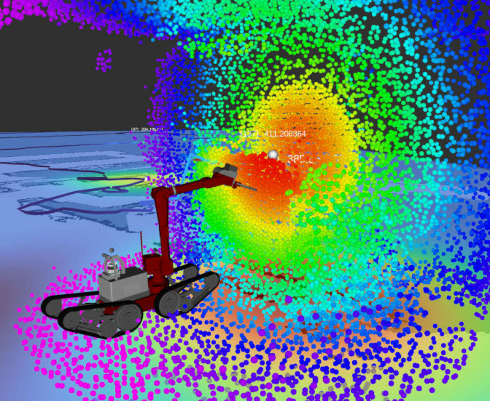

# Radiation Mapping: <br> Gaussian Process 2D and 3D radiation mapping and source localization

This project provides a method for radiation mapping and source localization utilizing Gaussian Processes, for use on mobile robots. The project was developed by [Team Hector](https://www.teamhector.de/) for the [ENRICH 2023](https://enrich.european-robotics.eu/) hackathon.

<p align="center">
    
    
</p>

## Instructions

### Overview
The Radiation Mapping node requires messages containing radiation measurements, the specific type of which can be dynamically configured (see Configuration), as well as an occupancy grid of the environment, which is typically provided by a SLAM system. For 3D mapping, an additional pointcloud scan of the environment is required.

With these inputs, a 2D and 3D radiation model is continuously generated and updated and then sampled to provide output data.

The node provides grid maps, containing predictions for radiation levels and uncertainty, overlaid on the provided occupancy grid. It also provides interactive markers, indicating the estimated locations of sources.

With 3D mapping enabled, a colored pointcloud is also provided, containing predictions and uncertainty in 3D.

### Dependencies

- [Ubuntu 20.04](https://releases.ubuntu.com/focal/)
- C++ 17
- [ROS Noetic](https://wiki.ros.org/noetic)
- [Eigen3](https://eigen.tuxfamily.org)
- [PyTorch](https://pytorch.org/)
- [GPyTorch](https://gpytorch.ai/)
- [Point Cloud Library (PCL)](https://wiki.ros.org/pcl/Overview)
- [ANYbotics grid_map](https://github.com/ANYbotics/grid_map)
- [Point Cloud Accumulator](https://github.com/tu-darmstadt-ros-pkg/pointcloud_accumulator)

The following ROS modules are required: <br><br>
`roscpp`, `std_msgs`, `geometry_msgs`, `grid_map_ros`, `grid_map_msgs`, `nav_msgs`, `tf2_ros`, `pcl_ros`, `interactive_markers`, `ros_babel_fish`,`cv_bridge`

## Installation
The package can be installed with the following command.
```
cd <Your ROS workspace>
git clone https://github.com/tu-darmstadt-ros-pkg/hector_radiation_mapping
catkin build
```

### Configuration
Before the system can be run, a number of configurations need to be done in the _params.yaml_ file, located at _radiation_mapping/config/params.yaml_. This file contains all the necessary parameters, to get Radiation Mapping to work.

The system is able to handle a variety of different input radiation messages, which are dynamically parsed using [ros_babel_fish](https://github.com/StefanFabian/ros_babel_fish). The topic from which these messages are received is configured using the key **subscribeTopic**.

The config keys **messageKey_cps** and **messageKey_rate** are used to configure the keys of the fields of the input radiation messages, that store the received Counts per Second (CPS) and Equivalent dose rate respectively. The unit of the dose rate (eg. microSievert/hour) can be specified using the key **radiationUnit**.

If the utilized message type does not contain both CPS and dose rate information, the  missing field can be set to an empty string. The key **messageKey_frameId** sets the frame relative to which the radiation messages are given.

The topics of the occupancy grid (`nav_msgs/OccupancyGrid`) and the accumulated pointcloud (`sensor_msgs/PointCloud2`) are configured using the keys **environmentMapTopic** and **environmentCloudTopic** respectively.


### Launching the node 
The Radiation Mapping node can be launched with 2D and 3D mapping enabled using
```
roslaunch radiation_mapping mapping.launch
```

If only 2D mapping is required, the node can be launched with
```
roslaunch radiation_mapping mapping_2D_only.launch
```

## ROS topics and services
### Topics
The following topics are used to communicate with the Radiation Mapping node.

#### Input
| Topic name | Type | Description |
| ------ | ------ | ------ |
|`/dose_rate`|_Configurable_|Message containing the radiation measurements|
|`/map`|`nav_msgs/OccupancyGrid`|Occupancy grid of the environment|
|`/pointcloud_accumulated`|`sensor_msgs/PointCloud2`|Pointcloud scan of the environment|

#### Output
| Topic name | Type | Description |
| ------ | ------ | ------ |
|`/radiation_mapping/grid_map_*`|`grid_map_msgs/GridMap`|Environment map with predictions and uncertainty overlaid|
|`/radiation_mapping/pointCloud3D`|`sensor_msgs/PointCloud2`|Environment scan, colored using predictions and uncertainty|
|`/radiation_mapping/marker`|`visualization_msgs/Marker`|Trajectory of the robot, colored according to radiation measurements|

Additionally, interactive markers for predicted radiation sources in 2D and 3D are provided by the system.

### Services
The Radiation Mapping node provides the following services.

| Service name | Input | Description |
| ------ | ------ | ------ |
|`/radiation_mapping/exportModel`|`String`|Exports the 2D and 3D representations of the model to the specified path|
|`/radiation_mapping/resetModel`|-|Resets the model|


## Test Data
We provide a processed ROS bag file from ENRICH 2023 at [TUdatalib](https://tudatalib.ulb.tu-darmstadt.de/handle/tudatalib/3974?locale-attribute=en).

You can play the bag file by running
```
rosbag play telemax_run2_processed_straight_init.bag
```
in another terminal window, before launching the Radiation Mapping node.
<p align="center">
    
    
</p>

## Additional reading

This method is based upon the paper [cite].
